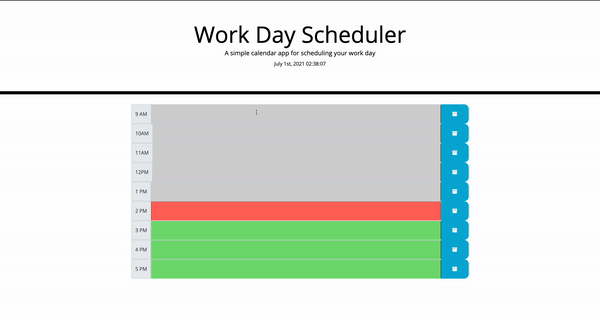

# Work day scheduler

## Features of the app
```
-Allows users to track their workday.
-Users can input their plans throughout the workday.
-If page reloads it will save all user input to prevent a loss of data.
-Each hour is color coded based on the current time of day that is listed near the top of the page. Gray means that hour has passed, red means thats the current hour and green means upcoming hours.
```
## Preview of the application 


## [Link to deployed website](https://kcmuse.github.io/Work-day-schedulerhw5/)
© 2021 Kaleb C Muse Productions, A student in the University of Washington Trilogy Full Stack Development Bootcamp!